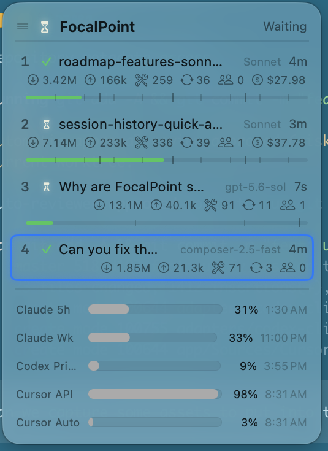

# FocalPoint

FocalPoint is the attention router for your coding agents. It keeps Claude
Code, Codex CLI, and Cursor sessions visible in one native macOS dashboard,
then takes you straight to the agent that needs you next.

<p align="center">
  
</p>

<p align="center"><em>One glance for every agent. One hotkey to jump back into the loop.</em></p>

## One hotkey takes you to the agent that needs you next

FocalPoint prioritizes errors and input requests across **Cursor, Claude Code,
and Codex**, then brings the corresponding window, tab, or pane forward—no
hunting through terminals.

Run several agents in parallel without becoming their human task scheduler.
When one needs approval, clarification, or help recovering from an error,
FocalPoint moves it to the front of the queue. Press the attention hotkey—or
the matching key on the macropad—to land where the work is waiting. Press it
again to move to the next agent that needs you.

Meanwhile, the menu-bar dashboard and desktop widget keep the whole operation
visible: which agents are thinking, which are running tools, which are done,
and how much context and quota each one has left.

## Install

FocalPoint currently requires **macOS 14 or newer on Apple Silicon**.

Install the prerequisites:

```sh
xcode-select --install
brew install rust jq
```

For precise managed-session focus and input routing, tmux is an optional
dependency:

```sh
brew install tmux
```

Then clone and run the installer:

```sh
git clone https://github.com/tchamp1912/FocalPoint.git
cd FocalPoint
./install.sh
```

The installer shows everything it will change and asks for confirmation. To
skip that prompt, run `./install.sh --yes`.

It will:

- build and install the `focalpointd` daemon, general `focalpoint` CLI, and
  narrow native `fpctl-agent` orchestration client;
- install and launch the native FocalPoint menu-bar app;
- configure a launchd user service so the daemon starts automatically;
- install the guarded `focalpoint-orchestrator` agent-control skill;
- install the Claude Code, Codex CLI, and Cursor adapters;
- install the managed-session launcher under `~/.config/focalpoint/` while
  preserving any existing FocalPoint tmux configuration;
- merge FocalPoint lifecycle hooks into each installed agent's user config,
  backing up those files before changing them; and
- preserve an existing `~/.config/focalpoint/config.toml`.

Restart any agent sessions that were already open so they load the new hooks.
The FocalPoint keyboard icon will appear in the macOS menu bar. Waiting/error
sessions are highlighted in the desktop widget without system notifications.
An orchestrator can set the daemon's attention order with `fpctl-agent`; the
app and attention key follow that same daemon-owned order.

With optional tmux support installed, start a managed agent using
`~/.config/focalpoint/focalpoint-run.sh claude` (or replace `claude` with
`codex`). See [the orchestrator guide](orchestrator/) for checkout usage and
layout options.

### Try it without the hardware

The app and all agent integrations work without a physical macropad. Install
in mock-device mode to exercise the complete software stack:

```sh
./install.sh --mock
```

### Verify the installation

```sh
focalpoint sessions       # live sessions and their assigned slots
focalpoint get-state      # aggregate agent state
```

`focalpoint ping` additionally checks for a connected hardware device, so it
is expected to fail with an app-only install unless the daemon is in mock mode.

## Features

### Attention routing, not notification noise

- Prioritize sessions that need intervention: errors first, then approval or
  input requests.
- Jump to the corresponding Cursor workspace, Claude terminal tab, or Codex
  working surface for that session.
- Cycle forward or backward through the attention queue with configurable
  global hotkeys.
- Let an orchestrator agent replace that queue with an explicit
  session order; the attention keys follow it without moving numbered slots.
- Launch a specific Claude or Codex model for a literal task in an exact, already-prepared
  directory. Environment/worktree setup remains the orchestrator's job.
- Read bounded normalized transcript tails and gracefully stop only the
  managed sessions associated with matching orchestrator task IDs.
- Use the same flow from numbered session keys on the physical macropad.
- Keep working while background agents think and run tools; FocalPoint tells
  you where your attention has the highest value.
- Permission requests get a two-second grace period, so Claude/Codex
  auto-approvals do not create false attention signals; only a request that
  remains blocked reaches `approval`; ordinary input requests use `waiting`.

### Every agent in one place

- Track concurrent Claude Code, Codex CLI, and Cursor sessions.
- Keep stable numbered slots while sessions change state or other sessions
  come and go.
- See the model, working directory, session name, current state, and elapsed
  time at a glance.
- Rename, reorder, focus, or end sessions directly from the app.

### Live stats and context pressure

- Display input/output tokens, tool calls, turns, subagents, and cost whenever
  the provider exposes them.
- Watch context-window consumption on a compact per-session gauge.
- Choose which stat badges appear from Settings.
- Set token and cost budget alerts for visual warning states.

### Status that is hard to miss

FocalPoint normalizes agent lifecycle events into six states:

| State | Meaning |
|---|---|
| `idle` | No active work |
| `thinking` | The model is reasoning or generating |
| `running` | A tool or command is executing |
| `waiting` | The agent needs ordinary user input |
| `approval` | A Claude Code permission decision needs attention |
| `done` | The current turn completed |
| `error` | Something failed and needs attention |

Those states drive the menu-bar attention badge, desktop widget, optional
keyboard backlight, and the RGB pattern assigned to each physical key.

### Account usage monitoring

- View Claude short-window and weekly quota periods.
- Read Codex plan limits through the local Codex app-server integration.
- Track Cursor API and Auto usage from the local Cursor sign-in.
- See utilization percentages and reset times without leaving your workflow.

Usage monitoring stays local and can be enabled or disabled per integration.

### Native macOS controls

- Compact menu-bar dashboard with a waiting/approval/error attention badge.
- Movable translucent desktop widget with the same live session data.
- Configurable global hotkeys for focusing sessions, accepting/rejecting,
  starting tasks, push-to-talk, and jumping through the attention queue.
- Quick actions that run in a session's working directory.
- Local history for completed sessions.

### Customizable hardware feedback

- Set a color, pattern, and animation period for every state.
- Use physical session keys to jump directly to the matching agent.
- Map the remaining keys, rotary dial, and joystick to your preferred agent
  workflow.
- Run the same action path through hotkeys when hardware is not connected.

## Supported integrations

| Integration | Live states | Session stats | Context gauge | Account usage |
|---|---:|---:|---:|---:|
| Claude Code | Yes | Yes | Yes | Yes |
| Codex CLI | Yes | Yes | Yes | Yes |
| Cursor | Yes | Yes | When available | Yes |
| Custom scripts and tools | Yes | Whatever you report | Optional | Optional |

Provider APIs expose different information, so a missing badge means that the
current integration or event did not report that value—not that the session
failed to register.

## Configure

Open **FocalPoint → Settings** from the menu-bar dashboard to configure:

- the desktop widget and menu-bar appearance;
- visible stat badges, budget alerts, and context-window fallback;
- Claude, Codex, and Cursor account-usage monitors;
- global hotkeys and attention-navigation order;
- per-state colors and LED animation patterns; and
- session history.

Low-level daemon actions and hardware mappings live in:

```text
~/.config/focalpoint/config.toml
```

## Update or uninstall

Pull the latest version and rerun the idempotent installer:

```sh
git pull
./install.sh
```

To preview or perform a clean uninstall:

```sh
./uninstall.sh --dry-run
./uninstall.sh
```

## Build your own integration

Any tool that can run a shell command can publish state:

```sh
focalpoint set-state running \
  --session my-session \
  --kind my-agent \
  --label "Implement login flow" \
  --cwd "$PWD"
```

Adapters can attach optional telemetry with repeated `--meta key=value`
arguments. See [the adapter guide](adapters/) for complete examples.

## Developer documentation

The public README intentionally focuses on installing and using FocalPoint.
Contributor and implementation details live in:

- [CLAUDE.md](CLAUDE.md) — repository guidance and component map
- [PLAN.md](PLAN.md) — product, hardware, and roadmap notes
- [PROTOCOL.md](PROTOCOL.md) — daemon, adapter, and device protocol
- [app/README.md](app/) — macOS app behavior and development
- [adapters/README.md](adapters/) — provider and custom adapter development

FocalPoint is in active development. The app and mock-device stack are usable
today; the open-hardware macropad is still evolving.
